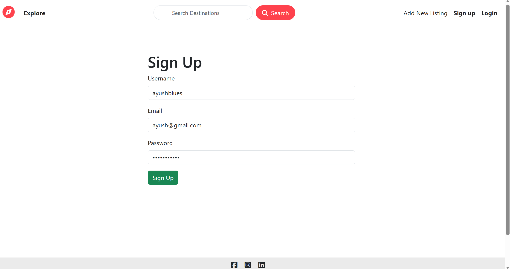
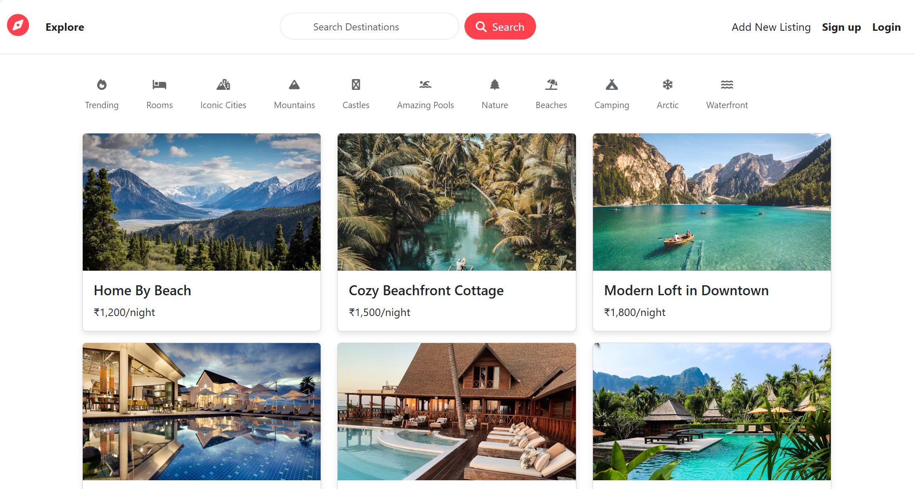
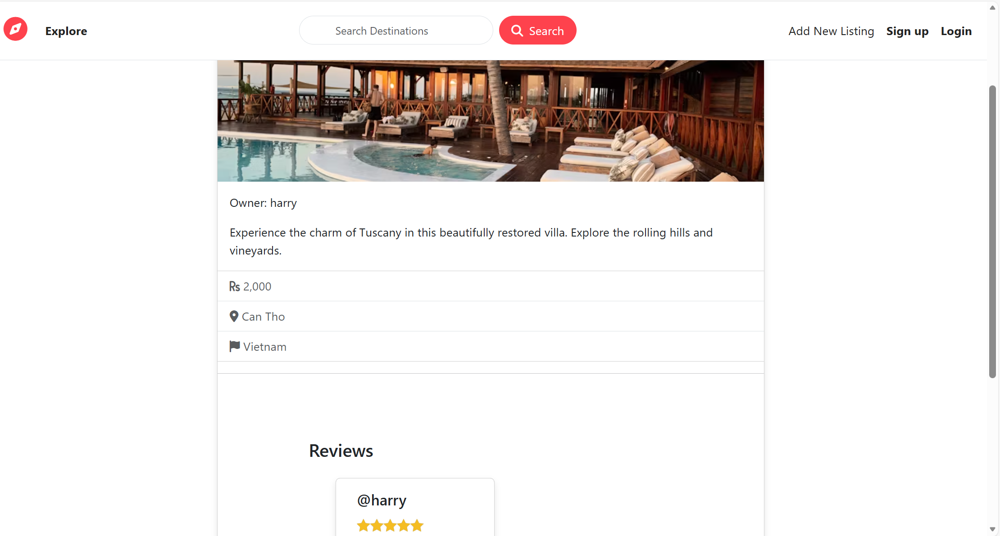

# WanderLust

WanderLust is a full-featured travel and accommodation web application built with Node.js, Express, MongoDB, and EJS. It allows users to browse, create, review, and manage listings for unique places to stay around the world.

---

*Add a screenshot of a listing page here*


*Add a screenshot of the homepage here*


*Add a screenshot of a listing page here*

---

## Features
- User authentication (signup, login, logout)
- Create, edit, and delete listings
- Add and manage reviews for listings
- Search and filter listings
- Responsive and modern UI
- Error handling and flash messages

## Tech Stack
- **Backend:** Node.js, Express.js
- **Database:** MongoDB, Mongoose
- **Frontend:** EJS, HTML, CSS, JavaScript
- **Authentication:** Passport.js

## Getting Started

### Prerequisites
- Node.js (v14 or higher)
- MongoDB

### Installation
1. Clone the repository:
   ```bash
   git clone https://github.com/yourusername/WanderLust.git
   cd WanderLust
   ```
2. Install dependencies:
   ```bash
   npm install
   ```
3. Set up your `.env` file (see `.env.example` for required variables).
4. Start MongoDB locally or use a cloud provider.
5. Run the app:
   ```bash
   npm start
   ```
6. Visit [http://localhost:3000](http://localhost:3000) in your browser.

## Folder Structure
- `app.js` - Main application entry point
- `routes/` - Express route handlers
- `controllers/` - Business logic for routes
- `models/` - Mongoose schemas and models
- `views/` - EJS templates
- `public/` - Static assets (CSS, JS, images)
- `utils/` - Utility functions and error handling

## Screenshots
Add your screenshots to the `docs/screenshots/` folder and update the image links above.

## License
This project is licensed under the MIT License.

---

*Feel free to contribute or open issues!*
